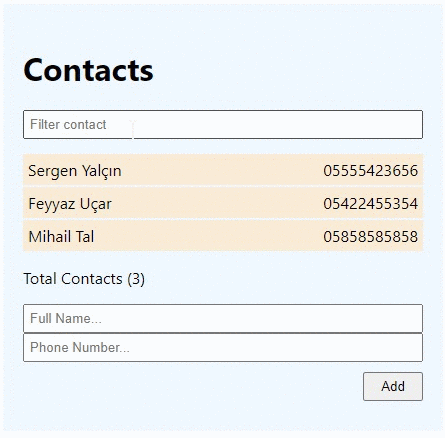

# Contacts App

## Description

Project aims to create a contacts app using React JavaScript Library.

## Project Skeleton

```
Contacts-App(folder)
|
|----readme.md       
|----images       
SOLUTION
├── public
│     └── index.html
├── src
│    ├── components
|    |       └── styles.css
│    │       ├──Contacts
|    |           └── Form
|    |               └── index.js
|    |           └── List
|    |                └── index.js
│    │     
│    ├── helper
│    │       └── data.js
│    ├── App.js
│    ├── App.css
│    ├── index.js
│    └── index.css
├── package.json
└── yarn.lock
```

## Objective


Build an Contact App using ReactJS.

### At the end of the project, following topics are to be covered;

- HTML

- CSS

- JS

- ReactJS

### At the end of the project, students will be able to;

- improve coding skills within HTML & CSS & JS & ReactJS.

- use git commands (push, pull, commit, add etc.) and Github as Version Control System.

🔗 To see live version 🎯https://tal58.github.io/patika.dev_solutions/


**<p align="center">&#9786; Happy Coding &#9997;</p>**

<br><br>
🌐 The desktop version of the web page is as follows;🧭
<br><br>

## 🖥️Desktop version
<br>

<br>
<br>
<br>
<br>
<br>
<br>
<br>
<br>
<br>
<br><br><br><br><br><br><br><br><br>


