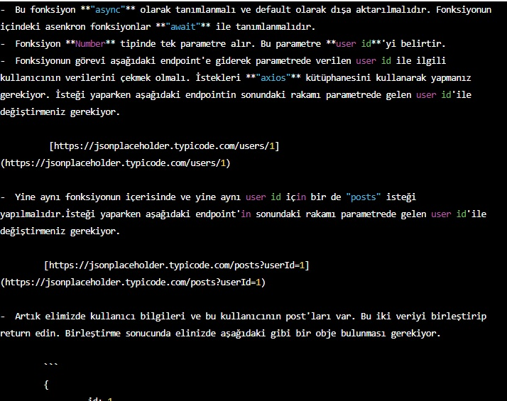
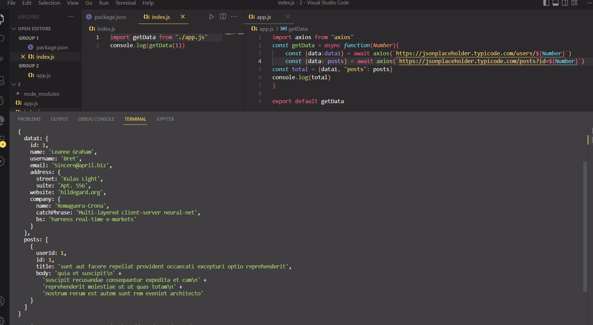

# Requirements 

 

## Learning Outcomes

At the end of the this coding challenge, students will be able to;

- Fulfill the requirements related to react.

- Analyze a problem, identify and apply programming knowledge for appropriate solution.

- Demonstrate their knowledge of algorithmic design principles by using JavaScript and Python effectively.

## Problem Statement

- That is mentioned on first part as an image.

**
&#9997; Happy Coding ⌛ 
**

## 🖥️ Screen shot of the solution is as follows;
 

 
 
 
 
 
 
 
 
 
         
